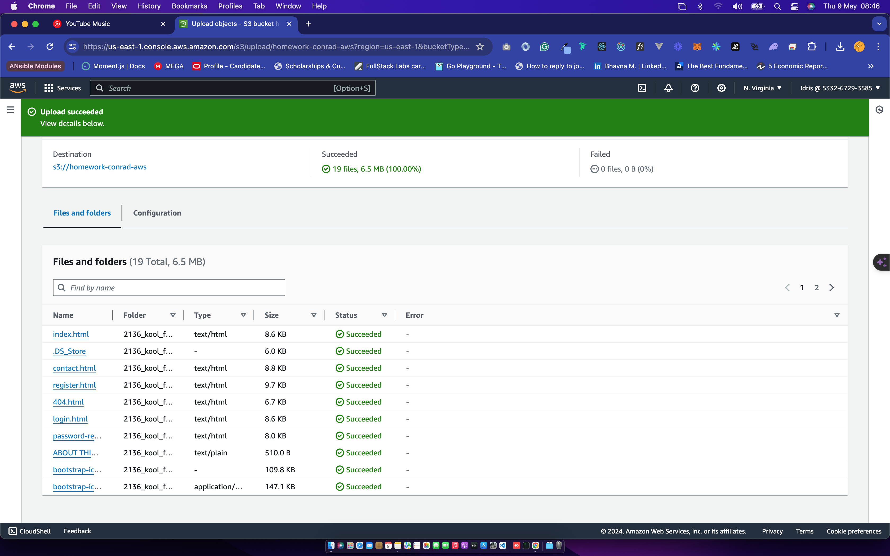
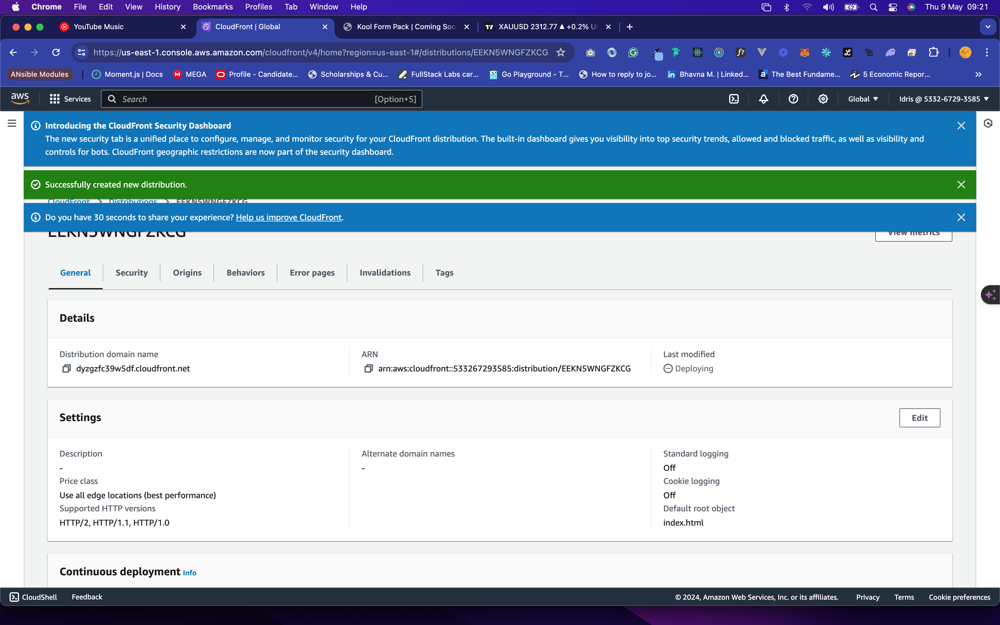

# host-static-webpage-in-a-private-s3-bucket-using-cloudfront

#Introduction

### Static Websites

A static website functions much like any traditional website but lacks dynamic components. Comprising basic HTML files, CSS stylesheets, images, and JavaScript files, static websites do not engage in dynamic requests or backend processing, such as handling form submissions or database interactions.

### Amazon S3: Object Storage Solution

Amazon S3 stands as an Object Storage service, offering virtually limitless storage capacity for diverse file storage requirements. Moreover, it enables users to configure storage buckets to serve as static websites accessible on the internet.

### Amazon CloudFront: Global Content Delivery Network

Amazon CloudFront operates as a global Content Delivery Network (CDN) service, proficiently caching and distributing files and data worldwide with remarkable speed and minimal latency.

Prerequisites:

- An active AWS account.
- The necessary files for your static website.

**Step 1 - Creating a Bucket on Amazon S3**

a) Upon logging into your AWS Console, navigate to Services > All Services. Locate "S3" and click on it to access the S3 dashboard,On the S3 Dashboard, click on the Create Bucket button to create a new storage bucket to store your static website files. Choose a unique bucket name. If you encounter an error stating "Bucket with the same name already exists," simply try another name until you find one that is globally unique.

b) To enable public access to our website, uncheck the option for "Block all public access." Ensure that you also check the box confirming acknowledgment of the statement below it. Leave all other settings intact & click on the Create bucket button at the bottom of the page.

**Step 2 - Uploading Website Files to S3 Bucket**

a) Once you've created a new bucket, click on the bucket name to access its details, Since a newly created bucket is empty by default, click on the "Upload" button to initiate the file upload process.

b) On the File Upload page, you can either click on "Add files" to upload a single file from your computer or select "Add folder" to upload multiple files from a folder.

c) Keep all other settings unchanged. Scroll to the bottom of the page and click on the "Upload" button to commence the upload process for the added files. Depending on your network speed and the quantity of files, you may need to wait while the files are uploaded to the S3 Bucket. After the upload process finishes, you can verify the successful upload of each file or check for any errors. Then, simply click on the "Close" button to return to the Bucket details screen.

**Step 3 - Enabling Static Website Hosting on S3 Bucket**

a) Navigate to the Bucket overview page, then click on the "Properties" tab and scroll down. Locate the "Static website hosting" section and click on the "Edit" button. Choose the "Enable" option for the Static website hosting setting. This action will unveil additional options, as depicted in the following screenshot.

Hosting type: Select Host a static website

Enter the Index document file name (case-sensitive) that will serve as the home page for your static website. This is usually “index.html” by convention.

Enter the Error document that will be shown when an error occurs. E.g. “error.html”, “404.html” etc.

**Step 4 - Adding a Bucket Policy**

Before granting access to the website on the bucket, we need to explicitly configure S3 Bucket permissions.

a) Navigate to the Bucket overview page, then click on the "Permissions" tab. Scroll down and locate the "Bucket policy" section. Within the Bucket policy section, click on the "Edit" button.

b) To provide public read access for your website hosted on this bucket, copy the following bucket policy and paste it into the Bucket policy editor below.

c) After pasting the policy, click on the "Save changes" button to apply the modifications.

d) You should now be able to access your website via the Amazon S3 Endpoint on the internet.

**Step 5 - Creating a CloudFront Distribution**

a) From the top navigation under Services > All Services, search for “CloudFront” and click on it.

b) Access the CloudFront Distributions page and click on the "Create distribution" button.

c) On the Create distribution page, navigate to the Origin section. Under Origin domain, input the Amazon S3 static website endpoint obtained from Step 4 earlier. You may also select it from the drop-down list if available. When prompted, click on "Use website endpoint" to automatically populate the endpoint.

d) Enter “index.html” for Default root object. This file name must match with the index document file name entered in Step 3 previously on S3.

e) Leave all other settings unchanged. Scroll to the bottom of the page and click on the "Create distribution" button. As previously mentioned, CloudFront will proceed to distribute all your files to edge locations worldwide. This process may require some time to complete.

f) Once the Status has been updated to "Enabled," the distribution is ready for access. You can find the URL for the distribution under the "Domain name" column. For instance, it may appear as: dyzg**\***.cloudfront.net. Simply access this URL using your web browser to view your static website.

**Conclusion:**
We've effectively configured a high-performance and highly available static website on AWS utilizing Amazon S3 and Amazon CloudFront. Remarkably, this setup was achieved without the need to set up a single server machine.
